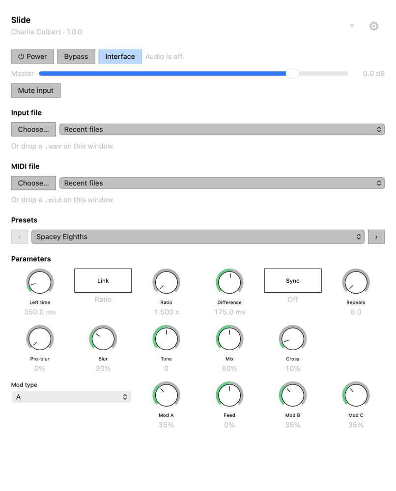
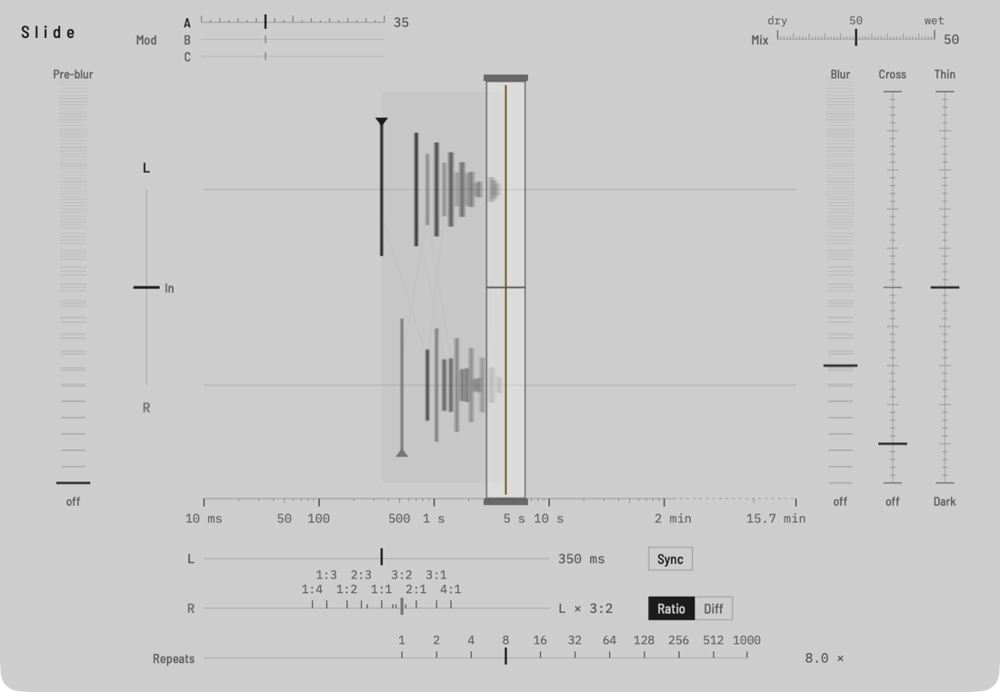

# char-clap-host

A cross platform CLAP host that I built to use to validate / test my plugins. It checks what the plug-in does against
the CLAP spec while it runs, and `validate.run` runs a set of conformance tests.

<p>
  
  
</p>

## Host extensions

It supports all 34 host-side extensions in the CLAP SDK, drafts included.

| Area | Extensions |
|---|---|
| Core | `log`, `thread-check`, `timer-support`, `posix-fd-support` (not on Windows), `event-registry` |
| Parameters | `params`, `params-origin`, `param-hovered`, `remote-controls` |
| Audio and notes | `audio-ports`, `audio-ports-config`, `surround`, `ambisonic`, `note-ports`, `note-name`, `voice-info`, `latency`, `tail` |
| State and presets | `state`, `preset-load`, `undo`, `resource-directory` |
| Processing | `thread-pool`, `scratch-memory`, `flush-events`, `triggers`, `transport-control`, `track-info` |
| Interface | `gui`, `webview` |
| Partial | `context-menu` (adds no items, cannot pop up), `tuning` (equal temperament only), `mini-curve-display` (accepted, never drawn), `background-progress` (cannot cancel) |

## Platforms

macOS, Windows and Linux, with the tests passing on all three.

WCLAP plug-ins (CLAP compiled to WebAssembly) load the same way as `.clap`
files. They run in [Wasmtime](https://wasmtime.dev) through a vendored copy of
[wclap-bridge](https://github.com/WebCLAP/wclap-bridge).

## Use

You can type commands at a prompt or use the GUI, which covers
parameters, presets, devices and the plug-in's own interface. A script or an
agent can pipe the same commands in, as text or JSON, and add `--json` to get
one JSON reply per line. `help` lists the commands.

```console
$ clap-host MySynth.clap
> activate 48000 512
> note on 60 100
> render 1.0 out.wav
> validate.run
```

`skills/clap-host/SKILL.md` explains how to drive it for coding agents.

## Build

```sh
git clone --recursive https://github.com/charCulbert/char-clap-host.git
cd char-clap-host
cmake -B build
cmake --build build
```

It needs CMake 3.21 or later and a C++17 compiler (C++20 with MSVC); on Linux
also `libasound2-dev`, `libgtk-3-dev` and `libwebkit2gtk-4.1-dev`. Configuring
downloads the Wasmtime C API; `-DNCH_WITH_WCLAP=OFF` builds without WCLAP
support. On macOS the binary is `build/clap-host.app/Contents/MacOS/clap-host`,
and `cmake --install build` puts a `clap-host` launcher in `~/.local/bin`.

To run the tests after building: `ctest --test-dir build`.

## More

[Using it](docs/usage.md) · [Commands](docs/commands.md) ·
[What it checks](docs/architecture.md) · [Testing](docs/testing.md)

MIT licence. Third-party code and its licences are listed in
[THIRD_PARTY_NOTICES.md](THIRD_PARTY_NOTICES.md).
